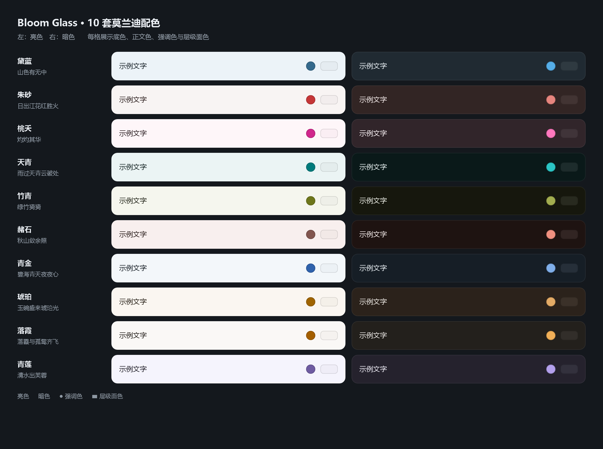
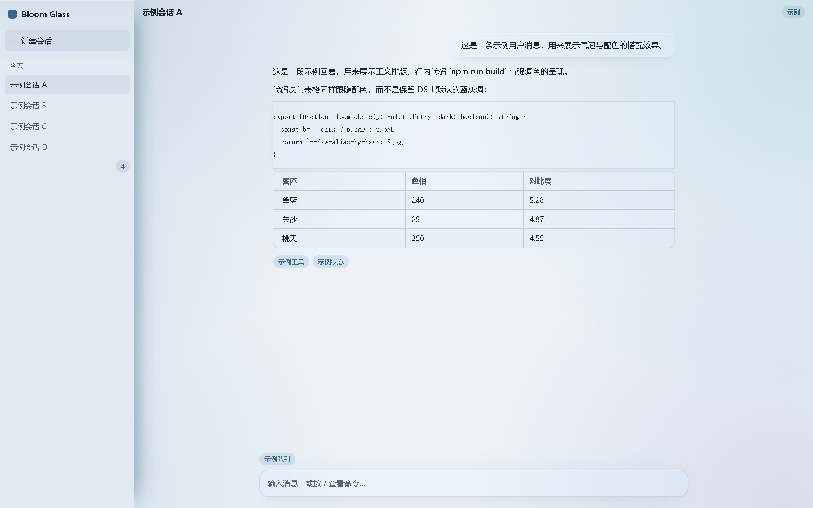
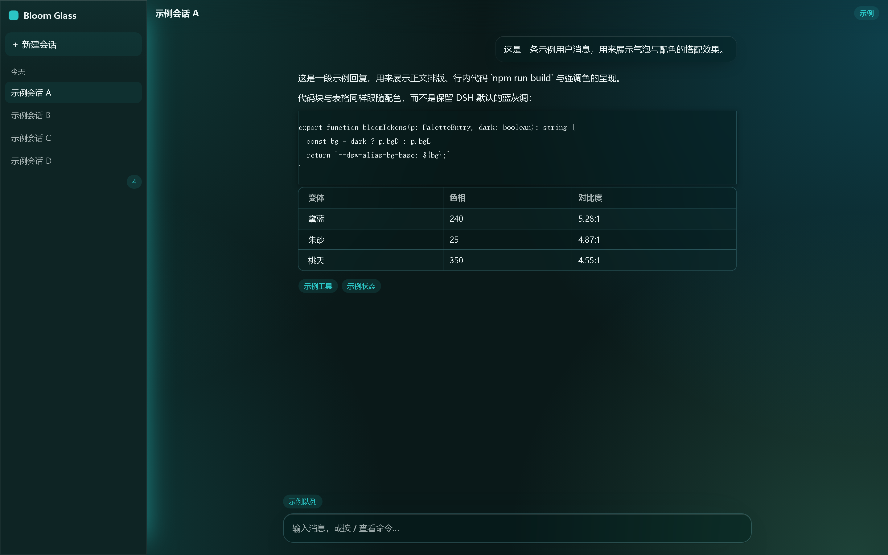
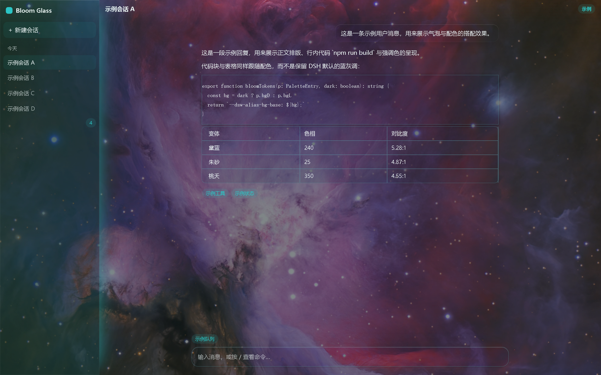

# dsh-bloomglass

一个 DeepSeek Harness Web 主题插件：十套 OKLCH 莫兰迪配色打底，可选一张壁纸铺满窗口、界面以磨砂玻璃叠上去。官方 Light / Dark / System 仍然掌权。

## 效果展示

10 套配色，每套都有亮色与暗色（底色 / 正文色 / 强调色 / 层级面色）：



| 亮色 · 黛蓝 | 暗色 · 天青 |
| --- | --- |
|  |  |

同一配色与窗口，只多了壁纸层 —— 表面色按玻璃浓度转为半透明，文字与边框保持不透明：



## 功能

- **10 套配色**：黛蓝 / 朱砂 / 桃夭 / 天青 / 竹青 / 赭石 / 青金 / 琥珀 / 落霞 / 青莲，明暗自适应
- **壁纸 + 磨砂**：本地 JPEG / PNG / WebP / GIF，无大小限制
- **一个独立设置栏**：设置 → Bloom Glass，含配色选择 + 玻璃浓度 / 模糊 / 饱和 / 压暗滑杆 + 保存 / 删除，不往「通用」页插行
- 壁纸关闭时是纯配色模式；打开后表面色按玻璃浓度转为半透明（文字与边框始终不透明）
- 只走官方 `overrideTokens` 覆盖层，从不 `setTheme('custom')`；不写 `settings.yaml`，不请求任何远程 URL

数据位置：壁纸存 IndexedDB，旋钮存 `localStorage`。

## 安装

`dsh web` 需已在运行。

```sh
dsh plugin --profile web add github:CosmoSail/dsh-bloomglass
```

装完**重启 `dsh web`**（刷新页面不够），然后打开 **设置 → Bloom Glass**。

首次启动会一次性读取这两个键——`localStorage` 的 `dsh-bloom-variant`（配色）、`dsh-frosted-window:knobs`（玻璃参数），以及 `dsh-frosted-window` 这个 IndexedDB 库里的壁纸——把先前保存的选择接过来。之后写入的是本插件自己的键，不再回读。

## 开发

```sh
git clone https://github.com/CosmoSail/dsh-bloomglass.git
cd dsh-bloomglass
npm install
npm test         # vitest，56 个用例
npm run typecheck
npm run build    # tsdown → lib/index.js + lib/client.js
npm run showcase # 重新生成 docs/showcase 下的演示页
```

`lib/` 随仓库提交（`dsh plugin add github:` 依赖它，也免去用户本地构建），因此**改完源码请重新构建再提交**。

**上游代码源**——本包的源码整合自下面两个上游项目：

| 上游代码源 | 取用内容 |
| --- | --- |
| [dsh-bloom-theme](https://github.com/webkubor/dsh-bloom-theme) `0.13.4`（`81ab8a0`）<br>MIT © 2026 webkubor | 色板数据、token 编译层、组件与玻璃样式表 |
| [dsh-frosted-window](https://github.com/SenryLee/dsh-frosted-window) `0.1.0`（`ccee61d`）<br>MIT © 2026 SenryLee | 壁纸上传与 IndexedDB 持久化、磨砂呈现器、玻璃样式、设置面板 |

除 `src/client/tokens.ts`（统一 token 管线）与 `src/client/css/palette-css.ts`（配色选择区样式）为本包新写外，其余源码均取自上述**上游代码源**。两份原始版权声明见 [LICENSE](LICENSE)，再次分发请保留。

契约：按官方 [package-and-install](https://github.com/deepseek-ai/deepseek-harness/blob/master/docs/user/develop/basic/publish.md) 以 `dsh.bundle` + `dsh.client` 分发。

## 许可

MIT，见 [LICENSE](LICENSE)。
